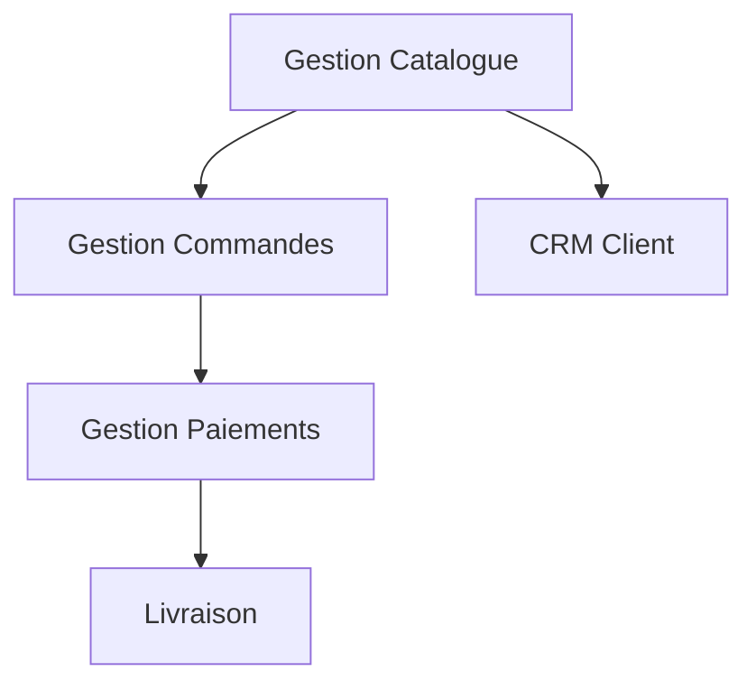

# Dossier d'Architecture d'Entreprise
## 

> **Version** : 1.0  
> **Date** : 2025-01-15  
> **Statut** : 🟡 En révision  

---

# 📋 Table des Matières

1. [Résumé Exécutif](#1--résumé-exécutif)
2. [Contexte & Périmètre](#2--contexte--périmètre)
3. [Analyse des Exigences](#3--analyse-des-exigences)
4. [Vues d'Architecture](#4--vues-darchitecture)
5. [Architecture Technique](#5--architecture-technique)
6. [Sécurité & Conformité](#6--sécurité--conformité)
7. [Sécurité & Exploitation](#7--sécurité--exploitation)

---

# 1 · Résumé Exécutif

## 🎯 Vision & Objectifs Stratégiques

### Vision Métier


### Objectifs Business Mesurables
- **Améliorer Expérience Client** : Atteindre 8.5 score (KPI: NPS Score)
- **Optimiser Conversion** : Atteindre 12.0 % (KPI: Conversion Rate)
- **Réduire Temps Traitement** : Atteindre 24.0 heures (KPI: Order Processing Time)

## 📊 Vue d'Ensemble de l'Architecture

### Diagramme de Contexte Système
```plantuml
!include diagrams/context_diagram.puml
```

### Diagramme C4 - Contexte
```plantuml
!include diagrams/c4_context.puml
```

### Schéma de Principe Détaillé
```plantuml
!include diagrams/overview.puml
```

### Décisions Architecturales Majeures
1. **Architecture microservices** pour la scalabilité et la résilience
2. **API-First approach** pour l'interopérabilité
3. **Multi-zone deployment** pour la sécurité et la conformité
4. **Event-driven patterns** pour le découplage

## 🚦 Recommandation & Next Steps

### Décision Go/No-Go : **🟢 GO**

**Prochaines étapes critiques :**
- [ ] Validation sécurité par le RSSI
- [ ] Setup des environnements de développement
- [ ] Formation des équipes techniques

---

# 2 · Contexte & Périmètre

## 🏢 Contexte Business

### Enjeux Métier
Développement d'une plateforme PetStore en ligne pour la vente et l'adoption d'animaux domestiques.

### Périmètre Fonctionnel
**Dans le périmètre :**
- Catalogue en ligne
- Commandes
- Paiement
- Gestion clients
- Support

**Hors périmètre :**
- Services vétérinaires
- Livraison physique
- Marketing digital

## 🎭 Parties Prenantes

### Sponsors & Decision Makers
| Rôle | Nom | Organisation | Responsabilité |
|------|-----|--------------|----------------|
| Sponsor Métier | TBD | Direction Métier | Financement & Vision |
| RSSI | TBD | Sécurité | Validation sécurité |
| DSI | TBD | IT | Implémentation |

### Équipes Projet
| Équipe | Département | Responsabilité |
|--------|-------------|----------------|
| PetStore-Web | Customer Experience | Interface web principale pour navigation catalogue et commandes |
| Inventory-Service | Supply Chain | Service de gestion des stocks et inventaire animaux |
| Payment-Gateway | Finance | Passerelle de paiement sécurisée externe |
| Mobile-App | Customer Experience | Application mobile iOS/Android |
| Catalog-Service | Supply Chain | Service de gestion du catalogue produits |
| Support-Portal | Support | Portail de support client |
| Billing-Service | Finance | Service de facturation interne |
| Customer-CRM | Support | Gestion relation client |

## ⏱️ Contraintes & Dépendances

### Contraintes Temporelles
| Jalon | Date Cible | Criticité |
|-------|-----------|-----------|

### Contraintes Budgétaires

### Dépendances Externes
- Validation réglementaire (CNIL, PCI-DSS)
- APIs partenaires externes
- Migration données legacy

---

# 3 · Analyse des Exigences

## 📋 Exigences Fonctionnelles

### Processus Métier Couverts
| ID | Processus | Description | Acteurs | Criticité |
|----|-----------|-------------|---------|-----------|
| 1.0 | **Traitement paiement** | nan | nan | 🟡 Standard |
| 2.0 | **Demande support** | nan | nan | 🟡 Standard |
| 3.0 | **Navigation catalogue** | nan | nan | 🟡 Standard |
| nan | **Passage commande** | nan | nan | 🟡 Standard |
| nan | **Mise à jour catalogue** | nan | nan | 🟡 Standard |
| nan | **Création ticket** | nan | nan | 🟡 Standard |
| nan | **Génération facture** | nan | nan | 🟡 Standard |
| nan | **Authentification user** | nan | nan | 🟡 Standard |
| nan | **Calcul coût stock** | nan | nan | 🟡 Standard |
| nan | **Vérification commande** | nan | nan | 🟡 Standard |
| nan | **Notification facturation** | nan | nan | 🟡 Standard |

### Matrice Fonctionnelle
| Processus | Applications Supportantes | Données Manipulées |
|-----------|---------------------------|-------------------|
| Traitement paiement | APP-WEB, APP-PAY | Animal, Customer, Order |
| Demande support | APP-WEB, APP-SUP | Animal, Customer, Order |
| Navigation catalogue | APP-WEB, APP-INV, APP-MOB | Animal, Customer, Order |
| Passage commande | APP-MOB, APP-PAY | Animal, Customer, Order |
| Mise à jour catalogue | APP-INV, APP-CAT | Animal, Customer, Order |
| Création ticket | APP-SUP, APP-CRM | Animal, Customer, Order |
| Génération facture | APP-PAY, APP-BILL | Animal, Customer, Order |
| Authentification user | APP-WEB, APP-CRM | Animal, Customer, Order |
| Calcul coût stock | APP-INV, APP-BILL | Animal, Customer, Order |
| Vérification commande | APP-SUP, APP-INV | Animal, Customer, Order |
| Notification facturation | APP-BILL, APP-SUP | Animal, Customer, Order |

## 🔧 Exigences Non-Fonctionnelles

### Exigences de Performance
| Métrique | Objectif | Mesure | SLA |
|----------|----------|--------|-----|


### Exigences de Sécurité
| Domaine | Exigence | Standard | Validation |
|---------|----------|----------|-----------|


### Exigences de Conformité
| Réglementation | Périmètre | Contrôles Requis | Responsable |
|----------------|-----------|------------------|-------------|
| GDPR | Données personnelles | Consentement, Portabilité | DPO |
| PCI-DSS | Données de paiement | Tokenisation, Audit | RSSI |

---

# 4 · Vues d'Architecture

## 🏗️ Vue Métier (Business View)

### Cartographie des Capacités


### Flux de Valeur
1. **Découverte** : Client browse le catalogue
2. **Sélection** : Client ajoute au panier
3. **Commande** : Client valide et paye
4. **Fulfillment** : Préparation et livraison

## 🖥️ Vue Applicative (Application View)

### Cartographie Applicative
```plantuml
!include diagrams/overview.puml
```

### Matrice Application-Processus
| Application Métier | Application | Processus Supportés | Statut | Criticité |
|-------------------|-------------|---------------------|--------|-----------|
| **Bus1** | **PetStore-Web** | Traitement paiement, Demande support, Navigation catalogue, Authentification user,  | New | Medium |
|  | **Mobile-App** | Navigation catalogue, Passage commande,  | New | Medium |
| **Bus2** | **Inventory-Service** | Mise à jour catalogue, Calcul coût stock,  | Existing | Medium |
| **Non défini** | **Payment-Gateway** | Génération facture,  | SaaS | Medium |
|  | **Catalog-Service** |  | Existing | Medium |
|  | **Support-Portal** | Création ticket, Vérification commande,  | New | Medium |
|  | **Billing-Service** | Notification facturation | Existing | Medium |
|  | **Customer-CRM** |  | Existing | Medium |

### Matrice Capacités-Applications

### Architecture Cible Simplifiée
- **Frontend** : SPA React (APP-WEB)
- **Backend** : Microservices REST (APP-INV, APP-PAY)
- **Données** : PostgreSQL + Redis
- **Intégrations** : API Gateway + Message Bus

## 🗄️ Vue Données (Data View)

### Modèle de Données Conceptuel
| Entité | Description | Classification | Rétention |
|--------|-------------|----------------|-----------|
| **Animal** | Informations détaillées sur l'animal | nan | nan  |
| **Customer** | Fiche client | nan | nan  |
| **Order** | Commande d'animaux & accessoires | nan | nan  |


---

#5 Vue Applicative

##· Solution globale 

## 🏗️ Patterns d'Architecture

### Patterns Appliqués
1. **API Gateway Pattern** : Point d'entrée unique pour tous les clients
2. **Backend for Frontend (BFF)** : APIs spécialisées par canal
3. **Event Sourcing** : Traçabilité complète des événements métier
4. **CQRS** : Séparation commandes/requêtes pour la performance
5. **Circuit Breaker** : Résilience face aux pannes de dépendances

##· Solution détaillée – & vues processus

### Vues par processus métier
#### 1.0 – Traitement paiement
```plantuml
!include diagrams/process_1.0.puml
```
#### 2.0 – Demande support
```plantuml
!include diagrams/process_2.0.puml
```
#### 3.0 – Navigation catalogue
```plantuml
!include diagrams/process_3.0.puml
```
#### nan – Passage commande
```plantuml
!include diagrams/process_nan.puml
```
#### nan – Mise à jour catalogue
```plantuml
!include diagrams/process_nan.puml
```
#### nan – Création ticket
```plantuml
!include diagrams/process_nan.puml
```
#### nan – Génération facture
```plantuml
!include diagrams/process_nan.puml
```
#### nan – Authentification user
```plantuml
!include diagrams/process_nan.puml
```
#### nan – Calcul coût stock
```plantuml
!include diagrams/process_nan.puml
```
#### nan – Vérification commande
```plantuml
!include diagrams/process_nan.puml
```
#### nan – Notification facturation
```plantuml
!include diagrams/process_nan.puml
```
---

# 6 · Architecture Technique

## 🌐 Vue Infrastructure

### Diagramme d'Architecture Réseau
```plantuml
!include diagrams/infrastructure_view.puml
```

###  Détails des ressources
| Layer | Service |Zone |Description |
|-------|---------|-----|------------|
| Compute | Kubernetes | PCI |nan |


## 🚀 Dimensionnement & Performance

### Métriques de Dimensionnement

### Stratégie de Scalabilité

---

# 7 · Sécurité & Conformité

## 🛡️ Architecture de Sécurité

### Vue d'Ensemble Sécurité
```plantuml
!include diagrams/security_view.puml
```

### Matrice des Contrôles de Sécurité
|Source | Destination | Protocole | Chiffrement |Authentification |
|-------|-------------|-----------|-------------|-----------------|
| APP-BILL(INTERNE) | APP-SUP(DMZ) | REST/HTTPS | TLS |Basic Auth |
| APP-INV(INTERNE) | APP-BILL(INTERNE) | REST/HTTPS | TLS |Basic Auth |
| APP-INV(INTERNE) | APP-CAT(INTERNE) | REST/HTTPS | TLS |Basic Auth |
| APP-MOB(DMZ) | APP-INV(INTERNE) | REST/HTTPS | TLS |Basic Auth |
| APP-MOB(DMZ) | APP-PAY(PCI) | REST/HTTPS | TLS |Basic Auth |
| APP-PAY(PCI) | APP-BILL(INTERNE) | REST/HTTPS | TLS |Basic Auth |
| APP-SUP(DMZ) | APP-CRM(INTERNE) | REST/HTTPS | TLS |Basic Auth |
| APP-SUP(DMZ) | APP-INV(INTERNE) | REST/HTTPS | TLS |Basic Auth |
| APP-WEB(DMZ) | APP-CRM(INTERNE) | REST/HTTPS | TLS |Basic Auth |
| APP-WEB(DMZ) | APP-INV(INTERNE) | REST/HTTPS | TLS |Basic Auth |
| APP-WEB(DMZ) | APP-PAY(PCI) | REST/HTTPS | TLS |Basic Auth |
| APP-WEB(DMZ) | APP-SUP(DMZ) | REST/HTTPS | TLS |Basic Auth |

## 🔐 Modèle de Sécurité

### Contrôles par Couche
| Couche | Contrôles | Technologies |
|--------|-----------|--------------|
| **Réseau** | Firewall, WAF, DDoS Protection | CloudFlare, AWS Shield |
| **Application** | OWASP Top 10, SAST/DAST | SonarQube, OWASP ZAP |
| **Données** | Chiffrement E2E, Tokenisation | AWS KMS, HashiCorp Vault |
| **Identité** | MFA, RBAC, SSO | Auth0, Azure AD |
| **Infrastructure** | CIS Benchmarks, Hardening | Chef InSpec, AWS Config |


## 📋 Conformité Réglementaire

### Matrice de Conformité
| Réglementation | Articles Applicables | Contrôles Implémentés | Gap Analysis |
|----------------|---------------------|----------------------|--------------|
| **GDPR** | Art. 25 (Privacy by Design) | Pseudonymisation, Consentement | 🟢 Conforme |
| **PCI-DSS** | Req. 3 (Protect stored data) | Tokenisation, Chiffrement | 🟡 En cours |
| **ISO 27001** | A.12.2 (Malware protection) | Antivirus, EDR | 🟢 Conforme |

---

# 8 · Sécurité & Exploitation

## 🔐 Zones Réseau & Contrôles

### Segmentation Sécurité

## 📊 Monitoring & Observabilité

### Stack d'Observabilité

### SLIs/SLOs Essentiels
| Service | SLI | SLO | Error Budget |
|---------|-----|-----|--------------|
| API Gateway | Latency P99 | < 500ms | 99.9% |
| User Auth | Success Rate | > 99.95% | 0.05% |
| Payment | Availability | > 99.99% | 0.01% |

---
> **Version** : 1.0